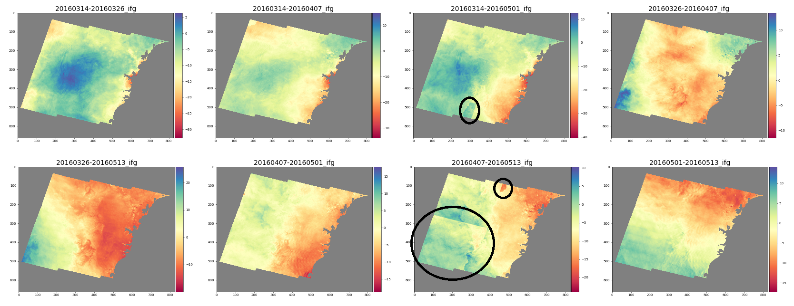
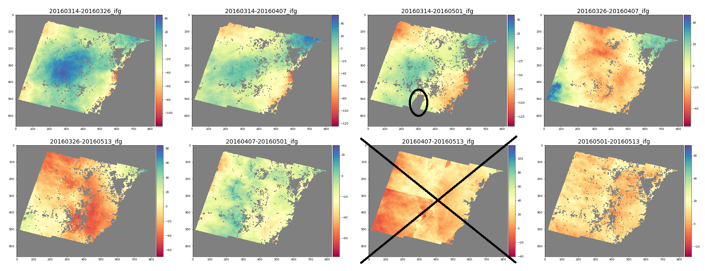

## Phase Closure

The phase closure functionality in PyRate is designed to identify and mitigate the 
effects of spatial unwrapping errors in the input interferograms (ifgs).
Identification is by forming "closure loops" between sets of ifgs and then
summing the phase in this closed loop for each pixel. Theoretically, the closure
phase should be equal to zero, though in reality, close to zero is good enough.
An unwrapping error in one of the loop edges will manifest as a closure phase of
n*2*pi radians.
By forming many loops amongst a network of ifgs, we attempt to identify
the individual ifgs that are contributing the unwrapping error.
Once identified, the unwrapping errors are mitigated by masking those pixels in
the necessary (but not all) ifgs.

By default, PyRate will do the phase closure step after orbital error, reference
phase and DEM error correction steps.
If a user wants to change the order of the corrections during PyRate's `correct`
step, copy and paste the following code-block in to the PyRate configuration file
and re-order the steps. This will over-ride the default behaviour.

```
[correct]
steps =
    orbfit
    refphase
    demerror
    phase_closure
    mst
    apscorrect
    maxvar
```


Five parameters control the phase closure functionality in PyRate.
These are described in the example PyRate configuration file
_input_parameters.conf_ as follows:

```
#------------------------------------
# Phase closure correction parameters

# closure_thr:         Closure threshold for each pixel in multiples of pi, e.g. 0.5 = pi/2, 1 = pi.
# avg_ifg_err_thr:     Ifgs with more than this fraction of pixels above the closure threshold, on average, will be dropped entirely.
# min_loops_per_ifg:   Ifgs are dropped entirely if they do not participate in at least this many closure loops.
# max_loop_length:     Closure loops with up to this many edges will be used.
# max_loop_redundancy: A closure loop will be discarded if all constituent ifgs in that loop have
#                      already contributed to a number of loops equal to this parameter.
closure_thr:         0.5
avg_ifg_err_thr:     0.05
min_loops_per_ifg:   2
max_loop_length:     4
max_loop_redundancy: 2
```

The PyRate _phase closure_ algorithm proceeds as follows:

1. Find the closed loops within the given ifg network having edges less than or
   equal to the parameter `max_loop_length`. This is done in the function
   `mst_closure.sort_loops_based_on_weights_and_date`.
   We perform several steps in this stage:
    
    - Find closed loops with edges numbering between 3 and `max_loop_length`.
      (function `mst_closure.__find_closed_loops`)
    - Sort ifgs within each loop based on first date (earlier date first).
      In case of a tie, we sort based on the second date. We then compute
      weight of each ifg as the temporal baseline in days.
      Then we sum the ifg weights in a loop to give the weight of each closure loop
      (function `mst_closure.__add_signs_and_weights_to_loops`). 
    - Sort the loops based on their weights, and in case of ties, further
      sort by primary date, and secondary date.
      (function `mst_closure.sort_loops_based_on_weights_and_date`)

2. Discard closure loops when all of the constituent ifgs have already contributed
   to a number of loops equalling the `max_loop_redundancy` parameter.
   (function `closure_check.discard_loops_containing_max_ifg_count`)

3. Drop ifgs from further PyRate processing when they are found to not form part
   of any closed loop.
   (function `closure_check.__drop_ifgs_if_not_part_of_any_loop`)

4. Compute phase closure sums for each pixel (in radians) in all the chosen loops
   and flag when the resultant absolute sum exceeds the quantity <`closure_thr` * pi>.
   The median closure sum across all pixels is subtracted from the closure phase 
   (optional parameter `subtract_median`, which is on by default).
   (function `sum_closure.__compute_ifgs_breach_count`)

5. Next, ifgs are dropped (removed from the processing list) if the fraction of
   constituent pixels breaching the `closure_thr` parameter averaged over the loops
   the ifg participates in exceeds the parameter `avg_ifg_err_thr`, or the ifg
   does not contribute to a number of loops at least equal to the parameter
   `min_loops_per_ifg`.
   (function `closure_check.__drop_ifgs_exceeding_threshold`)
   
6. Steps 1-5 are repeated iteratively until a stable list of ifgs is returned.
   The iteration is orchestrated by the function `closure_check.iterative_closure_check`.
   
7. Once a stable list of ifgs is found, a new ifglist is written in the working
   directory, and used for further PyRate processing.
   
8. The final step involves finding pixels in the ifg phase data that breach the
   closure threshold defined by the `closure_thr` parameter. Those pixels in breach
   are masked (changed to NaN value) for those pixels in those ifgs.
   (function `closure_check.mask_pixels_with_unwrapping_errors`)

## Example usage

To illustrate the PyRate phase closure functionality, we use a small example dataset
of 8 Sentinel-1 ifgs which connect 5 common acquisition dates:

```
20160314-20160326
20160314-20160407
20160314-20160501
20160326-20160407
20160326-20160513
20160407-20160501
20160407-20160513
20160501-20160513
```

The below plots show the ifgs following `prepifg`:



Circled in black are some visually obvious unwrapping errors.

In this example, we run the `correct` step with orbital correction and phase
closure correction enabled, and the following parameters:

```
orbfitmethod:  2
orbfitdegrees: 1
orbfitlksx:    10
orbfitlksy:    10

closure_thr:         0.5
avg_ifg_err_thr:     0.1
min_loops_per_ifg:   2
max_loop_length:     4
max_loop_redundancy: 2
```

We get the following log information from iteration #1:

```
16:40:45 closure_check:126 421776 INFO 0/7 Closure check iteration #1: working on 8 ifgs
16:40:45 closure_check:187 421776 INFO 0/7 Total number of selected closed loops with up to MAX_LOOP_LENGTH = 4 edges is 9
16:40:45 closure_check:202 421776 INFO 0/7 After applying MAX_LOOP_REDUNDANCY = 2 criteria, 8 loops are retained
16:40:52 plot_closure:76 421776 INFO 0/7 8 closure loops plotted in out/phase_closure_dir/closure_loops_iteration_1_fig_0.png
```


The 8 plotted closure loops from iteration #1 show areas where the `closure_thr`
threshold has been breached as either dark red or dark blue. The previously
circled unwrapping errors show up as breached areas in several closure loops.

The `avg_ifg_err_thr` parameter is set to 10% in this example. This is enough
to detect the largest mis-closed area, which amounts to around 25% of the phase
data area spatially. The ifg introducing this mis-closure (20160407-20160513)
is dropped and iteration #2 continues:

```
16:40:52 closure_check:126 421776 INFO 0/7 Closure check iteration #2: working on 7 ifgs
16:40:52 closure_check:187 421776 INFO 0/7 Total number of selected closed loops with up to MAX_LOOP_LENGTH = 4 edges is 5
16:40:52 closure_check:202 421776 INFO 0/7 After applying MAX_LOOP_REDUNDANCY = 2 criteria, 5 loops are retained
16:40:58 plot_closure:76 421776 INFO 0/7 5 closure loops plotted in out/phase_closure_dir/closure_loops_iteration_2_fig_0.png
```


Now the ifg network is smaller (7 ifgs) and less closure loops (5) are retained.
Three smaller breached areas are evident: in the top left, centre bottom and
bottom right of the image. The average breached area is now not greater than 10%
so no further ifgs are fully dropped and no further iteration is required.

Finally, pixels found to be breaching the `closure_thr` are masked in ifgs:



The previously circled unwrapping error in ifg 20160314-20160501 has now been
masked, but this spatial area has not been masked in other ifgs. In this case,
the algorithm has been successfully able to attribute the source of the unwrapping
error to this single ifg. The ability to do this depends on the parameter
settings chosen.

